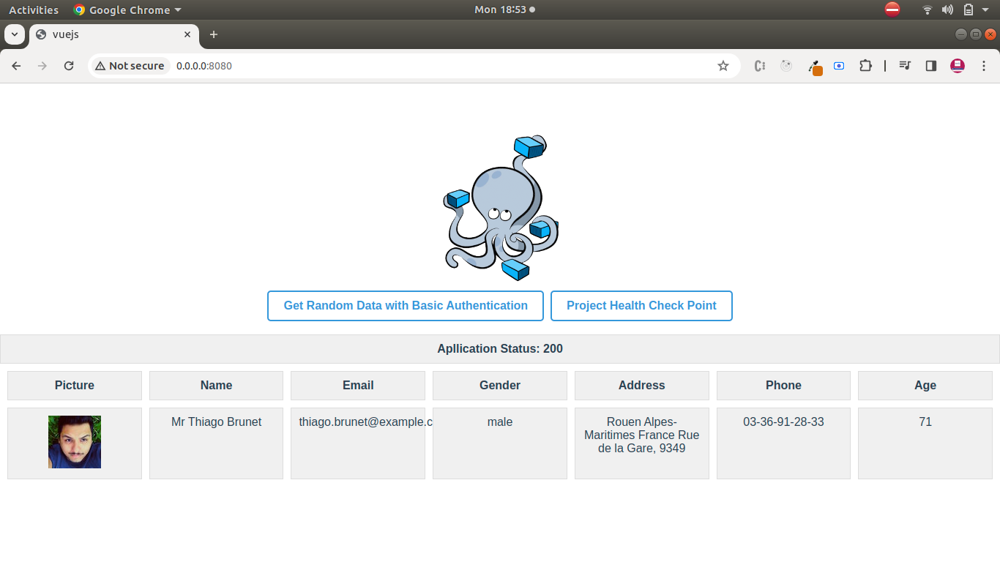

# vuejs-docker

Added by Ashish Kumar Saxena
# Folder Structure

```
├── compose.yaml
├── README.md
└── vuejs
    ├── babel.config.js
    ├── Dockerfile
    ├── node_modules
    ├── package.json
    ├── public
    │   └── index.html
    ├── src
    │   ├── App.vue
    │   ├── assets
    │   │   └── logo.png
    │   ├── components
    │   │   └── User.vue
    │   └── main.js
    └── yarn.lock
```
# Deploy with docker compose

```
run at the root level below command

docker compose up -d --build

docker compose up -d
[+] Running 1/2
 ⠸ Network clarivate-fe_default  Created                                                                                                        14.3s 
 ✔ Container clarivate-fe-web-1  Started                                                                                                        14.0s 
```
# Expected result on terminal
```
amogh@amogh-Vostro-3480:~/clarivate-fe$ docker ps
CONTAINER ID   IMAGE              COMMAND                  CREATED              STATUS              PORTS                                               NAMES
5bdf681ec0d9   clarivate-fe-web   "docker-entrypoint.s…"   About a minute ago   Up About a minute   0.0.0.0:8080->8080/tcp, :::8080->8080/tcp           clarivate-fe-web-1

```

After the application starts, navigate to `http://0.0.0.0:8080` in your web browser.


# after perform the click action on both button




